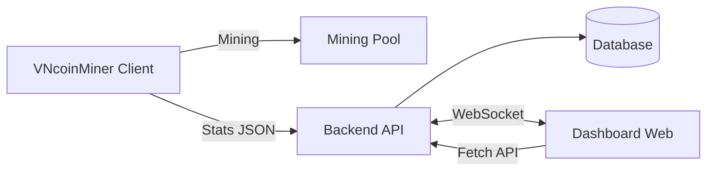
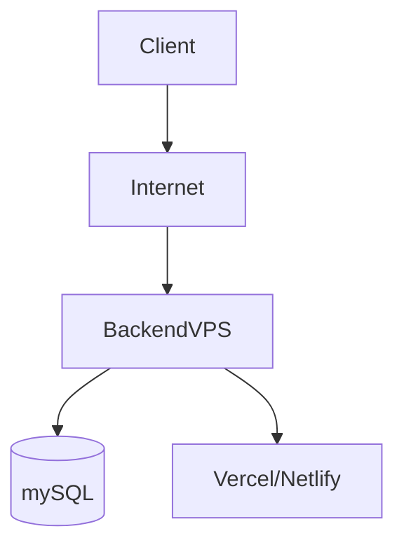

📌 Ngôn ngữ: [English](README-EN.md) | 🇻🇳 Tiếng Việt
> Status: 🚧 Đang phát triển (Planning → Development)

# VNcoinMiner
Ứng dụng đào coin CPU/GPU mã nguồn mở, minh bạch, dễ sử dụng dành cho người Việt 🇻🇳🪙

## 📑 Mục lục
1. [Giới thiệu](#-giới-thiệu--introduction)
2. [Tính năng](#-tính-năng--features)
3. [Kiến trúc hệ-thống](#-kiến-trúc-hệ-thống--architecture)
4. [Cài đặt](#-cài-đặt--installation)
5. [Sử dụng](#-sử-dụng--usage)
6. [API](#-api)
7. [Mô hình doanh thu](#-mô-hình-doanh-thu--revenue-model)
8. [Lộ trình phát triển](#-lộ-trình-phát-triển--roadmap)
9. [License](#-license)

## Giới thiệu:

VNcoinMiner là một ứng dụng đào coin CPU/GPU mã nguồn mở, cho phép người dùng đào các loại coin phổ biến thông qua các miner hiện có như XMRig hoặc lolMiner.

Dự án tập trung vào tính minh bạch và khả năng quản lý, cung cấp hệ thống giám sát thời gian thực và dashboard web giúp theo dõi hiệu suất đào, nhiệt độ và trạng thái của từng máy đào.

Mục tiêu của VNcoinMiner là xây dựng một nền tảng đào coin đơn giản, dễ sử dụng nhưng vẫn đủ mạnh cho người dùng cá nhân hoặc nhóm nhỏ, đồng thời hỗ trợ mô hình doanh thu hợp pháp thông qua phí phát triển minh bạch và chương trình affiliate.

Dự án được phát triển với mục tiêu vừa có thể triển khai thực tế, vừa là một sản phẩm portfolio chất lượng cao, thể hiện khả năng xây dựng hệ thống phân tán, backend, frontend và tối ưu hiệu năng đào.

---

## Tính năng:

Dựa trên các mục tiêu trên, VNcoinMiner bao gồm các tính năng sau:

- Đào coin bằng CPU/GPU thông qua XMRig / lolMiner
- Giám sát thời gian thực (hashrate, nhiệt độ, shares)
- Gửi thống kê lên backend
- Dashboard web quản lý máy đào
- Cấu hình pool và ví
- Phí phát triển 1% minh bạch

---

##  Kiến trúc hệ thống

VNcoinMiner được thiết kế theo mô hình phân tán gồm nhiều thành phần độc lập...



🔹 Thành phần hệ thống

🔴 Client miner
- Chạy XMRig hoặc lolMiner trên máy người dùng
- Thu thập thông tin hiệu suất (hashrate, nhiệt độ, shares, uptime)
- Gửi dữ liệu định kỳ về backend dưới dạng JSON

🔴 Backend API
- Nhận dữ liệu thống kê từ client
- Lưu trữ vào cơ sở dữ liệu
- Cung cấp API cho dashboard
- Broadcast dữ liệu real-time qua WebSocket

🔴 Database
- Lưu thông tin worker, lịch sử hashrate, trạng thái thiết bị và cấu hình

🔴 Dashboard web
- Hiển thị trạng thái máy đào theo thời gian thực
- Biểu đồ hiệu suất và thu nhập ước tính
- Quản lý nhiều worker từ một giao diện

🔴 Mining pool
- Xử lý việc đào coin
- Trả phần thưởng dựa trên hashrate

🔹 Luồng hoạt động
1. Client chạy miner và thu thập thông tin hiệu suất
2. Client gửi dữ liệu thống kê (5–10 giây/lần) đến Backend API
3. Backend lưu dữ liệu vào Database
4. Backend broadcast dữ liệu mới đến Dashboard thông qua WebSocket
5. Dashboard cập nhật giao diện theo thời gian thực
6. Mining pool xử lý việc đào và trả thưởng trực tiếp cho user theo cấu hình ví

🔹 Công nghệ sử dụng
- Giao tiếp Client → Backend: HTTP/HTTPS (JSON)
- Realtime Dashboard: WebSocket
- Backend: Node.js / FastAPI (dự kiến)
- Database: mySQL
- Mining engine: XMRig / lolMiner

🔹 Điểm nổi bật kiến trúc
- Thiết kế module tách biệt, dễ mở rộng
- Hỗ trợ quản lý nhiều máy đào đồng thời
- Giám sát thời gian thực bằng WebSocket
- Có thể triển khai trên VPS hoặc mạng nội bộ
- Minh bạch trong việc xử lý dữ liệu và mô hình doanh thu



---

## ⚙️ Cài đặt

(Đang phát triển)

Dự kiến:

```bash
git clone ...
cd client
python main.py
```

---

## 🛣️ Lộ trình phát triển

- [ ] Client miner cơ bản (chạy XMRig)
- [ ] Backend API nhận thống kê
- [ ] Lưu database
- [ ] Dashboard web cơ bản
- [ ] WebSocket realtime
- [ ] Dev fee 1%
- [ ] Optimization report
